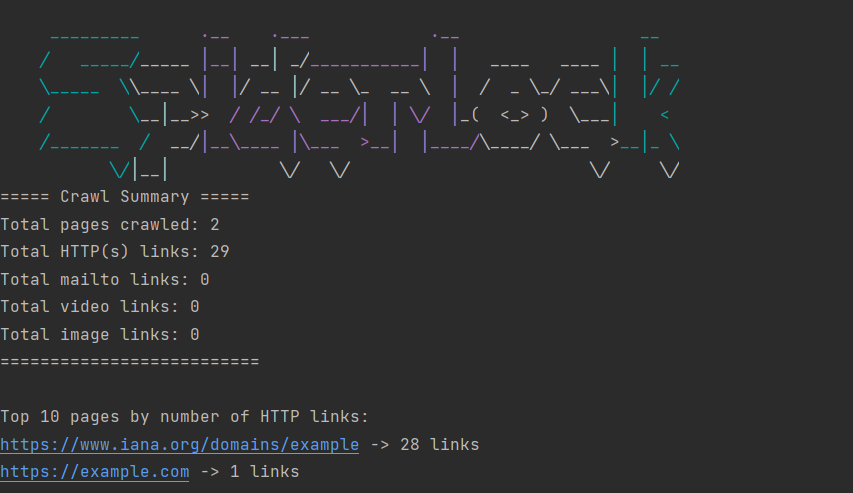

# Spiderlock

 

**Spiderlock** is a Python web crawler designed for cybersecurity enthusiasts, pentesters, and web analysts. It supports both **breadth-first (BFS)** and **depth-first (DFS)** crawling strategies and can visualize website structures as a **2D graph**, showing pages and their connections.

---

## Badges


---

## Features

- **BFS & DFS crawling** – Choose the strategy based on your analysis needs.
- **Robots.txt aware** – Automatically respects crawling rules.
- **Sitemap generation** – Builds a clear map of website pages and their links.
- **2D visualization** – Displays a graphical representation of the site structure.
- **Customizable depth & delay** – Control crawl depth and request delay.
- **Modular & Pythonic** – Easy to extend or integrate into pentesting workflows.

---

## Installation

1. Clone the repository:
```bash
git clone https://github.com/yourusername/Spiderlock.git
cd Spiderlock
```

2. Install dependencies (preferably in a virtual environment):
```bash
pip install -r requirements.txt
```

---

## Usage

Basic usage example:
```bash
python crawler.py --url https://example.com --strategy bfs --max-depth 2
```

Options:
- `--url` : The starting URL to crawl.
- `--strategy` : Choose `bfs` or `dfs`.
- `--max-depth` : Set the maximum crawl depth.

---

## Example Output

```
Starting crawl on https://example.com
Strategy: BFS | Max Depth: 1

Visited Pages:
[0] https://example.com
[1] https://www.iana.org/domains/example

Crawl complete. Total pages visited: 2
```

The **2D graph visualization** shows pages as nodes and links as edges.

---

## Screenshots / Demo

 
---

## Future Features

- Export crawl results to JSON/CSV
- Interactive 2D/3D graph visualization
- Multi-threaded crawling for speed
- Browser simulation (JavaScript support)

---

## Contributing

Contributions are welcome! Please open an issue or pull request for bug fixes, features, or improvements.
